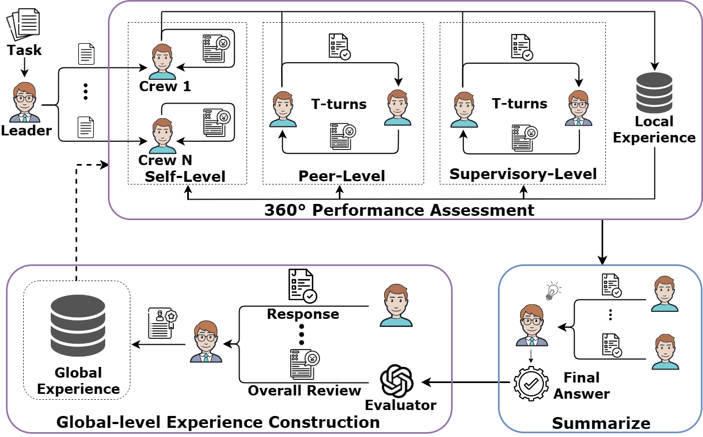

# Official Repo of paper [**R**eusable **E**xperience **A**ccumulation with **360°** Assessment(360°REA)](https://arxiv.org/abs/2404.05569)

Towards A Reusable Experience Accumulation with 360° Assessment for Multi-Agent System

 

## Introduction

Large language model agents have demonstrated remarkable advancements across various complex tasks. Recent works focus on optimizing the agent team or employing self-reflection to iteratively solve complex tasks. Since these agents are all based on the same LLM, only conducting self-evaluation or removing underperforming agents does not substantively enhance the capability of the agents. We argue that a comprehensive evaluation and accumulating experience from evaluation feedback is an effective approach to improving system performance. In this paper, we propose Reusable Experience Accumulation with 360° Assessment (360°REA), a hierarchical multi-agent framework inspired by corporate organizational practices. The framework employs a novel 360° performance assessment method for multi-perspective performance evaluation with fine-grained assessment. To enhance the capability of agents in addressing complex tasks, we introduce dual-level experience pool for agents to accumulate experience through fine-grained assessment. Extensive experiments on complex task datasets demonstrate the effectiveness of 360°REA.

## Methodology

In this paper, we propose **R**eusable **E**xperience **A**ccumulation with **360°** Assessment (360°REA) which is a hierarchical multi-agent interaction framework. The proposed 360°REA contains three main phases:

1. We adopt a hierarchical division of labor approach to accomplish the given task.
2. To enhance the crew agent with task-solving capabilities, we propose dual-level experience pool, which contains to subexperience pool: global experience and local experience.
3. We employ the 360° performance assessment to evaluate the performance of agents from multiple perspectives.

## Dataset

All datasets can be found in the `data/` folder.

## Setup

- Install the OpenAI package:

  ```
  pip install openai
  ```

- Set the `OPENAI_API_KEY` in your environment variables.

## Quick Start

- Start Jupyter Notebook:

  ```
  jupyter notebook
  ```

- Open the desired notebook from the Jupyter interface.

We provide Jupyter notebooks for each of the main tasks. Please check out the comments within the notebooks for more information:

- Trivia Creative Writing: `notebook\CreativeWriting\run_CW.ipynb`
- Codenames Collaborative: `notebook\LogicGridPuzzle\run_LGP.ipynb`
- Logic Grid Puzzle: `notebook\TravelPlan\run_TP.ipynb`


# Citation

```text
@inproceedings{gao2024rea,
    title={360°REA: Towards A Reusable Experience Accumulation with 360° Assessment for Multi-Agent System}, 
    author={Gao, Shen and Li, Hao and Shi, Zhengliang and Huang, Chengrui and Tu, Quan and Tian, Zhiliang and Huang, Minlie and Shang, Shuo},
    booktitle={Proceedings of the ACL Conference on Artificial Intelligence},
    year={2024}
}
```
